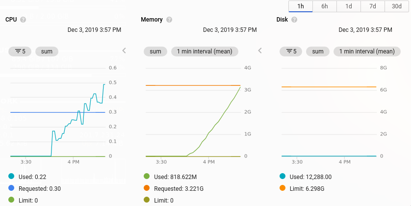

O(n^2) again, now with Laravel Horizon memory usage.

<!--more-->

---

We started to experience OOM failures in our Redis instance and quickly begin to investigate what was causing the issue.

After some investigation we were able to find the root cause, Laravel Horizon was not deleting completed jobs until a timeout occurs, which is by default the same timeout used to expire jobs pushed into the queue. Since we have a large ammount of jobs (almost 450k each 30min) the redis memory started to grow quadratically, with each job being cached with it's entire payload, which in most cases are entire models/collections serialized. We can't descrease the timeout either, it was shared between created jobs(but not processed yet) and completed jobs.

After reading [this post](https://randomascii.wordpress.com/2019/12/08/on2-again-now-in-wmi) I think this fits well with our problem, that's definitely an `O(n*n)` problem.

Then I decide to fill an issue, [laravel/horizon#715](https://github.com/laravel/horizon/issues/715) to track the problem.
In a fork I introduced a `trim.completed` timeout, which turns out to solve the issue:

Later on, a Laravel member opened a pull request with our proposed changes in [laravel/horizon#720](https://github.com/laravel/horizon/pull/720).

That's it for now, see you again next time :).
