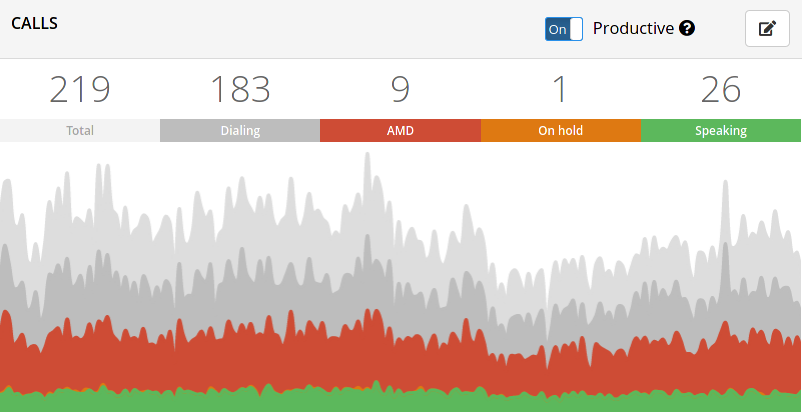
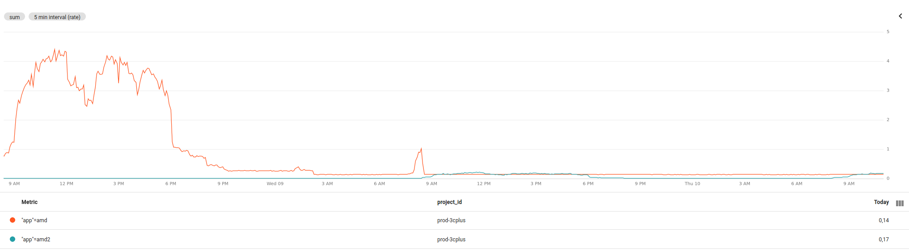

We finished the full rollout of a new version of our AMD project, let's find out the improvements made alongside some implementation notes!

<!--more-->

---

## 1. Introduction

It was almost 3 years since I launched the first AMD, which stands for Answering Machine Detection. This type of program is very common in telephony systems because of predictive dialing. I know, there's a lot of new terms, so let's break this down.

When we talk about call centers, a feature that is common to every system is predictive dialing. This mode of dialing works by placing a shit ton of calls and hope that at least a few will reach the end user.

You're right, "Just a few?" you may ask yourself.

See, placed calls don't get picked up pretty often, the call may ring x times and get dropped, the callee may be sleeping, no signal, just busy or don't give a fuck to answer an unknown number (I can't blame them for this).

Meanwhile the agent is there, sitting at his desk with a headset on just waiting for a call to be connected, and this can take a while depending on the quality of the mailing and the aggressiveness of the predictive dialing algorithm. Agents in "idle" are worthless, they are are not doing any work at all and a good predictive dialer will always try to keep agents busy talking to real people.

Another cause of idleness are answering machines, since the call is answered in an automated manner it is automatically connected to an agent. The agent then realizes it is not in call with a real person and hang up. This is the worst case scenario because when the call is connected with an agent it's wasting time with something that will not make any profit. And this happens a lot, really.

Take a look at this pic:

The gray "ish" sections are not answered and failed calls, which we'll ignore for brevity.

Let's focus in the red section of the graph, alongside the green one, are the only ones that connect with agents. The approximate number of answering machines in the operation over time is at least 3-4 times the amount of calls with real people. Take this with a grain of salt because it can vary depending on a series of factors.

As you can see, the AMD calls are the ones that represent a real thread to our operations.

If we could only detect this early 🤔.

Hold on, we actually can!

## 2. First things first

Our telephony SIP stack is mainly composed of [Asterisk](https://github.com/asterisk/asterisk) instances, there's a [nice plugin](https://github.com/asterisk/asterisk/blob/master/apps/app_amd.c) available out of the box to detect answering machines. It works but it's not good enough, it only detect silences, word count and changes in pitch caused by beeps and things like that but can be easily tricked into wrong results due to linguistic differences.

The AMD 1 was then introduced to counter this problem three years ago, and it worked very well using an AI based approach.

With the latest advances in deep learning in the recent years, from [GANs](https://en.wikipedia.org/wiki/Generative_adversarial_network) to [Convolutional Neural Networks](https://cs231n.github.io/convolutional-networks) many tasks can now be automated and many more will be as new architectures and datasets evolve.

This project was a big deal in several aspects:

- First in-company AI project.
- Easy to integrate as an [Asterisk module written in Rust](/blog/posts/asterisk-rust-module).
- Ability to evolve as the training set grows.
- Uses a deep convolutional neural network heavily inspired by the Google's MobileNetV2 architecture.
- State of the art approach for audio classification.

Since we have plenty of unlabeled data available in the form of audio files, a dataset for audio classification was built from the ground up.

The arquitecture chosen was Mobilenet V2 since it's a well optimized model. As a 2-dimension convolutional neural network we needed to convert the raw GSM files into a 2D representation to feed the model. The obvious approach was to use spectrograms, a visual representation of the [STFT](https://en.wikipedia.org/wiki/Short-time_Fourier_transform) of the sound wave.

You can learn more about the preprocessing step [here](/blog/posts/audio-spectrograms-in-tensorflow), behare that this was done in Tensorflow 1.0 and may need some tweaking to run on tensorflow 2.

It was not perfect tho, there were some caveats:

- The preprocessing was done using [sox](http://sox.sourceforge.net/), which being a command line tool has aditional overhead and sometimes segfaulted with no aparent reason.
- We could simplify the preprocessing pipeline by not using spectrograms as input.
- Running the tensorflow model using tensorflow for Go introduced some memory leaks and it was hard to debug due to CGO constraints.

# 3. Improvements

Since Tensorflow 2 was around the corner already I decided to create a new version from scratch to address some of this problems.

The new version, AMD 2.0, has a series of improvements over the last version:

- Uses a model named [SwishNet](https://arxiv.org/pdf/1812.00149.pdf), a state-of-the-art 1D Convolutional neural network that excels at audio related tasks.
- Is a more efficient implementation and being a 1D convolutional neural network it performs decently well on CPU.
- Data augmentation is used to expand the training set, which helps the model to generalize better to unseen data.
- Built with Google's Tensorflow 2.0.
- Runs on top of [Tensorflow Serving](https://github.com/tensorflow/serving) in production, a high performance server implementation to serve Tensorflow models. We are able to achieve an average prediction time of ~12ms, including the preprocessing step!
- Uses raw wav files as input data
- 20 MFCC samples are computed and used to feed the model.
- Everything runs inside the tensorflow computational graph so we're able to remove the external dependency on sox.

And here is the final result. The latest release handling the full load consumes less resources than the older version in idle!

You can see some of the augmentation and audio processing steps [here](https://colab.research.google.com/drive/1JNqcSfPKZo5B1ksHm-Ks2eJSvV01jDUs?usp=sharing).

We are looking forward to improve our dataset with balanced classes and build our model on top of a pretrained one(YAMNET) to improve the prediction accuracy and model's generalization, but that is another story.

It has been a long journey with the project and I am very proud of the results we got with this new milestone.

See ya next time 😄.
