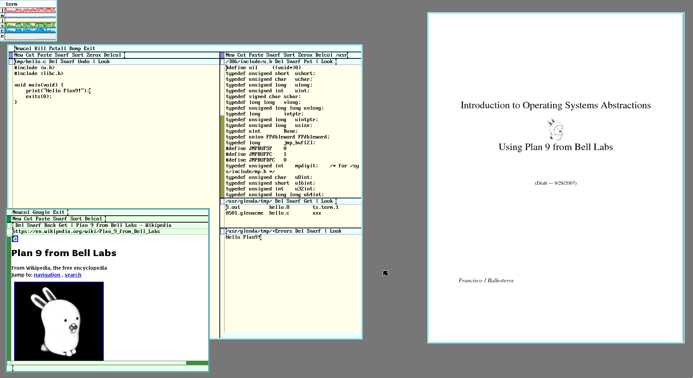

Plan9 is a research operating system from the same group who created UNIX at Bell Labs Computing Sciences Research Center (CSRC). It emerged in the 80s, and its early development coincided with continuing development of the later versions of Research UNIX. Let's install it in the raspberry pi 3!

<!--more-->

## 1. Installing Plan9

To install the plan9 os you need a micro sdcard with at least 2GB (I use a 4GB one).

> **You probably need to log in as root in order to run the following commands**

Check the name of your sd card:

```bash
fdisk -l
```

> For me it's `/dev/sdc`.

Format the device to FAT32:

```bash
mkfs.vfat -n 'PLAN9' -I /dev/sdc
```

Download the plan9 image and write to your sdcard or save it somewhere:

> **Remember to change your device!**

```
wget -O - http://plan9.bell-labs.com/sources/contrib/miller/9pi.img.gz | \
  gunzip -c | dd bs=4M of=/dev/null status=progress
```

Now you are ready to boot Plan9 on raspberry pi!

## 3. First steps

Since the plan9 image you just downloaded is a fully bootable one, it not require the installation step.

When the pi boots up, you get into the Plan9 graphical interface, [rio(1)](http://man.cat-v.org/plan_9/1/rio). Rio is a minimalist window manager, it's just a bunch of rectangles that you draw in the screen 😄.



To use Plan9 you definitely need a three button mouse. Hold the right button, hover `New` and release. Again hold the right button, drag a rectangle big enough and release. Now you have a shell, [rc(1)](http://man.cat-v.org/plan_9/1/rc). First of all check your internet connection:

> I'm using ethernet, probably wifi only work on plan9 forks like 9front.

```bash
ndb/dns # start the dns resolver
ip/ipconfig # configure interfaces and get ip address with dhcp
ip/ping google.com # check internet connection
```

> In rc `Ctrl + c` not work, try `Del` to stop the ping.

As you can see, some of the commands are similar with the UNIX ones, but Plan9 is an entirely different operating system in several ways. You can also note the concept of namespaces, all ip related commands are in `ip/`, disk in `disk/` and so on.

> If you receive an error about dns resolution, try to reboot and run DNSSERVER=8.8.8.8 before the commands above.

Now let's try to use a web browser. You are thinking about Chrome? Firefox? Nop. Plan9 has it's own web browser, [abaco(1)](http://man.cat-v.org/plan_9/1/abaco)

```bash
webfs # start a filesystem that handle urls
abaco 'http://google.com/search?q=plan9'
```

It's pretty ugly I know, no css, no js, _but it works_!

> The network settings are not persisted if you reboot, so just like your `.profile` in bash, add the commands to `$home/lib/profile`.

## 3. Installing Git

Unfortunately git is not ported to Plan9, but David du Colombier wrote a rc script to mimic the original git commands:

```bash
hget -o $home/bin/rc/git http://9legacy.org/9legacy/tools/git
chmod +x $home/bin/rc/git
```

The rc scripts are stored in the `$home/bin/rc` directory and automatically appended to /bin, so you can run then in the global namespace.

## 2. Installing Golang

```bash
hget -o go1.10.tbz http://www.9legacy.org/download/go/go1.10-plan9-arm7-bootstrap.tbz
tar xvf go1.10.tbz && mv go-* go

# Go configs
mkdir -p gopath/bin
GOPATH=$home/gopath
GOBIN=$GOPATH/bin
GOROOT=$home/go
bind -a $GOROOT/bin /bin # append the go binaries to the end of the /bin entries
bind -a $GOBIN /bin
```

> Don't forget to add the binds and envs to `$home/lib/profile` too

Let's check:

```bash
go env
```

---

I'm in love with Plan9, it's such a cool operating system to learn. If you are interested too check the following resources:

- [9front](http://fqa.9front.org)
- [9p.io](https://9p.io/plan9/)
- [9legacy.org](http://www.9legacy.org)
- Book: [Introduction to Operating System Abstractions with Plan9](https://lsub.org/who/nemo/9.intro.pdf)
- Book: [Notes on the Plan 9 Kernel Source](http://www.r-5.org/files/books/computers/internals/unix/Francisco_Ballesteros-Notes_on_the_Plan_9_Kernel_Source-EN.pdf)

Expect more posts in the future. See you again next time 😄.