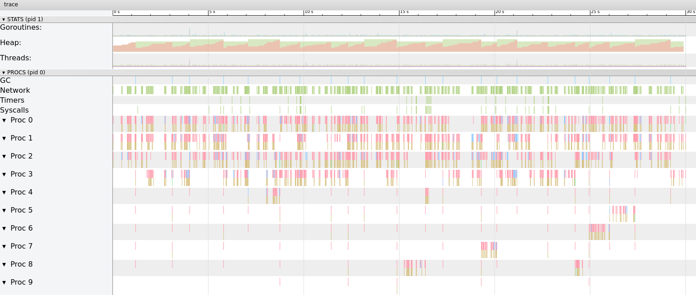

Buffers are key pieces when writing software, they can be smaller or bigger based on your needs. But when you have too much of these with big sizes things start to Go out of control.

---

Looking at one of our Go microservices heap and trace profiles I spotted the
linear increase in heap memory which triggered an abnormal number of GC runs (almost 25) during the 30s spam of the profile. The memory usage was pretty high too.



It was clear that the Go's Heap was filling up and the garbage collector was running too often because of that.

With further investigation, I took a CPU profile that showed runtime.memclrNoHeapPointers was consuming most of the cpu time. That was strange, you would normally expect to see pieces of your code to be running more often and not the runtime of the language itself:

```
(pprof) top
Showing nodes accounting for 440ms, 57.14% of 770ms total
Showing top 10 nodes out of 285
      flat  flat%   sum%        cum   cum%
     130ms 16.88% 16.88%      130ms 16.88%  runtime.memclrNoHeapPointers
      80ms 10.39% 27.27%       80ms 10.39%  runtime.futex
      60ms  7.79% 35.06%       80ms 10.39%  syscall.Syscall
      40ms  5.19% 40.26%       60ms  7.79%  runtime.scanobject
      30ms  3.90% 44.16%       30ms  3.90%  runtime.usleep
      20ms  2.60% 46.75%       20ms  2.60%  runtime.findfunc
      20ms  2.60% 49.35%       20ms  2.60%  runtime.memmove
      20ms  2.60% 51.95%       30ms  3.90%  runtime.newobject
      20ms  2.60% 54.55%       20ms  2.60%  runtime.nextFreeFast
      20ms  2.60% 57.14%       20ms  2.60%  runtime.pageIndexOf
```

The runtime.memclrNoHeapPointers function clear memory addresses starting at the given address, it's part of the sweep phase in the Go's mark-and-sweep garbage collector. This function handles noscan objects, which means
that it only handle memory cleaning of objects that do not have
pointers. That's a clear clue for us that we are allocating too much memory for slices/arrays/buffers, but where? I'm not allocating large structures anywhere in the code :thinking_face:.

Going further down the call tree:

```
(pprof) top memclrNoHeapPointers
Active filters:
   focus=memclrNoHeapPointers
Showing nodes accounting for 130ms, 16.88% of 770ms total
Showing top 10 nodes out of 12
      flat  flat%   sum%        cum   cum%
     130ms 16.88% 16.88%      130ms 16.88%  runtime.memclrNoHeapPointers
         0     0% 16.88%      130ms 16.88%  cloud.google.com/go/storage.(*Writer).open.func1
         0     0% 16.88%      130ms 16.88%  google.golang.org/api/gensupport.NewInfoFromMedia
         0     0% 16.88%      130ms 16.88%  google.golang.org/api/gensupport.NewMediaBuffer
         0     0% 16.88%      130ms 16.88%  google.golang.org/api/gensupport.PrepareUpload
         0     0% 16.88%      130ms 16.88%  google.golang.org/api/storage/v1.(*ObjectsInsertCall).Media
         0     0% 16.88%      130ms 16.88%  runtime.(*mheap).alloc
         0     0% 16.88%      130ms 16.88%  runtime.largeAlloc
         0     0% 16.88%      130ms 16.88%  runtime.makeslice
         0     0% 16.88%      130ms 16.88%  runtime.mallocgc
```

The root cause seems to be Google's Storage Writer implementation, more
precisely gensupport.NewInfoFromMedia that's using most of the cpu time.

The heap memory profile is also pointing out to the same conclusion:

```
(pprof) top
Showing nodes accounting for 34359.68kB, 100% of 34359.68kB total
Showing top 10 nodes out of 28
      flat  flat%   sum%        cum   cum%
   32768kB 95.37% 95.37%    32768kB 95.37%  google.golang.org/api/gensupport.NewMediaBuffer
  557.26kB  1.62% 96.99%   557.26kB  1.62%  crypto/elliptic.initTable
  520.04kB  1.51% 98.50%   520.04kB  1.51%  hash/crc64.makeSlicingBy8Table
  514.38kB  1.50%   100%   514.38kB  1.50%  github.com/golang/protobuf/proto.RegisterType
         0     0%   100%    32768kB 95.37%  cloud.google.com/go/storage.(*Writer).open.func1
         0     0%   100%   557.26kB  1.62%  crypto/ecdsa.Verify
         0     0%   100%   557.26kB  1.62%  crypto/ecdsa.verify
         0     0%   100%   557.26kB  1.62%  crypto/ecdsa.verifyGeneric
         0     0%   100%   557.26kB  1.62%  crypto/elliptic.(*p256Point).p256BaseMult
         0     0%   100%   557.26kB  1.62%  crypto/elliptic.p256Curve.CombinedMult
```

Looking at the code of NewMediaBuffer we can see the following:

```go
func NewMediaBuffer(media io.Reader, chunkSize int) *MediaBuffer {
	return &MediaBuffer{media: media, chunk: make([]byte, 0, chunkSize)}
```

The make language constructor is initializing a byte array of chunkSize
items and a custom capacity, which is allocated straight away.

NewInfoFromMedia, which is visible in the CPU profile uses this method
to create a buffer:

```
NewMediaBuffer(rdr, googleapi.DefaultUploadChunkSize)
```

Guess what, **googleapi.DefaultUploadChunkSize [is 16MB(!)](https://github.com/googleapis/google-api-go-client/blob/5f2719ce745f503c8b0195b0b769fedfecad98be/googleapi/googleapi.go#L57)**

That's a huge memory buffer for each writer created, didn't take much
time to realize where the heap spikes and GC load is comming from.

Since we handle small objects(<100kb) most of the time, adjusting the ChunkSize
to a lower value fixed the issue:

```go
writer := s.Bucket.Object(filename).NewWriter(s.Context)
writer.ChunkSize = defaultChunkSize
```

Damn Google, not all programs are handling such large files :|

This simple change decreased the memory usage of the service by **10-20x**.

We can achieve even better results with buffer reuse, a technique used on databases and cache applications to reuse memory buffers to avoid the overhead of a garbage collector run and future heap allocations. This can be done easily in Go with something like [sync.Pool](https://golang.org/pkg/sync/#Pool) or [go-slab](https://github.com/couchbase/go-slab).

See you again next time 😄.
